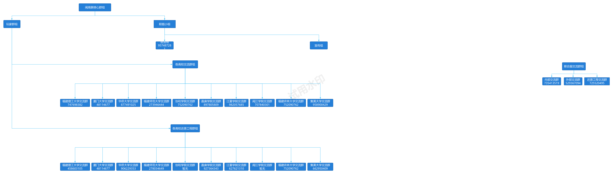

# QA-Knowledge-Base

> Q&amp;A LLM Online Knowledge Base  
> 更新时间 `2025-03-15 14:08:33`

闽高联问答机器人官方文档向量库

## 仓库规范

1. 本仓库 `/docs` 目录结构应与 [闽高联](https://www.kdocs.cn/team/2396183976) 在线文档目录结构保持一致，便于管理人员同步
2. 文档定期导出为 pdf 文件同步到本仓库

## 知识库 API

> `Bearer Token` 请联系负责人申请  
> `datasetId`: 67d51815e286b5216bf73565
> `collectionId`: 67d51acbe286b5216bf73852

### 知识库集合数据请求示例

```shell
curl --location --request POST 'https://flow.illtamer.com/api/core/dataset/data/v2/list' \
--header 'Authorization: Bearer {{authorization}}' \
--header 'Content-Type: application/json' \
--data-raw '{
    "offset": 0,
    "pageSize": 10,
    "collectionId":"67d51acbe286b5216bf73852",
    "searchText":""
}'
```

### 知识库集合数据响应示例

```json
{
  "code": 200,
  "statusText": "",
  "message": "",
  "data": {
    "list": [
      {
        "_id": "67d51ae7e286b5216bf73b0e",
        "datasetId": "67d51815e286b5216bf73565",
        "collectionId": "67d51acbe286b5216bf73852",
        "q": "总而言之，闽⾼联宣传纳新方案的核心目标是什么？",
        "a": "总而言之，闽⾼联宣传纳新方案的核心目标是通过多种线上线下结合的方式，有效地宣传闽⾼联，吸引更多对 Minecraft 游戏感兴趣的高中生加入，壮大组织力量。",
        "chunkIndex": 0
      }
    ],
    "total": 8
  }
}
```

## 附录

### 闽高联组织架构图

